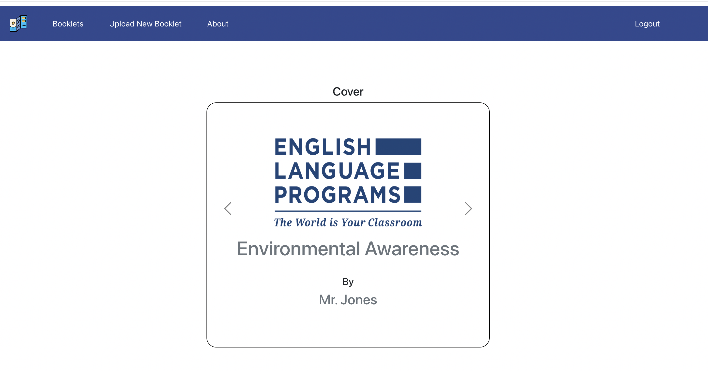

# Booklet

## Introduction

This project is designed to make the process of compiling and sharing student essays easier for teachers. With this tool, teachers can easily collect and compile their students' essays into a digital booklet. Once the booklet is compiled, it can be easily shared online with students, parents, and other interested parties.

### Features

- **Easy essay collection**: Teachers can easily make booklets by simply collecting their students' work in a PDF format, and uploading them on the page.
- **Secure sharing**: Once the booklet is compiled, teachers can easily share it with students, parents, and other interested parties with a unique URL.
- **Easy to use**: Once someone receives the URL, they can immediately see the booklet without having to register or navigate the page.

### Technologies

Project is created with:

- React
- Firebase
- React Bootstrap
